# Analysing Indian Electrical Load Data

## Hourly Electrical Load from 2019 to 2024

With the help of Python libraries like Pandas and MatPlotLib, the data with ~47000 rows and 7 columns was analyzed.
The results of the analysis are presented below.

>**NOTE:**
> - The graphs and data present below are reproducible.(Steps mentioned in )
> - Only the Data upto 2023 is used as there only is data upto 30 April 2024

First, let's define the term **Average Day**: An average day is calculated across region and time interval.
We have 24 datapoints for each day but averaging them would give us a single average load value for the day.
That value is meaningless if we want to study the pattern of consumption of electricity throughout the day.
An **Average Day** load curve of a year, is the curve obtained after following this process:

 - For each hour of the day, find the mean of the 365 entries associated with it.
 - Ex: The average of 00:00 AM from 1-1-2019 to 31-12-2019
 - By doing so for each hour of the day, we get 24 values.
 - The curve obtained by plotting these, is called an **Average Day** load curve.
So, to find what a typical day looks like, I used the following method.

Let's find out what an **Average Day** in the **West** looked like back in **2023**:

 - Reshape the data to get the load value column-wise for each hour of the day, for the whole year. Something like this: 
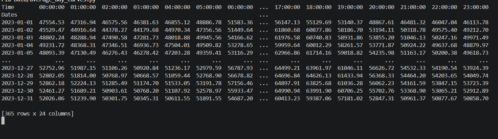

 - Now, we take an average, but column-wise. This way we can get the average load at each time of the day.
   24 values, each corresponding to an hour of the day.
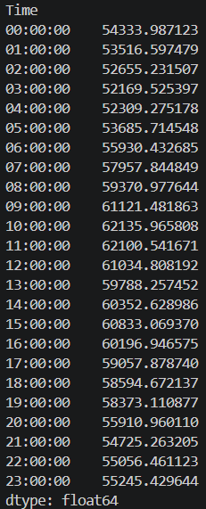

 - Plotting it using MatPlotLib, we get:
   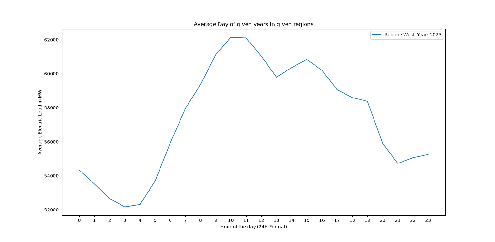

   ## Load Curves of the Average Day(2019-2023)

   Plotting the evolution of the **Average Day** Load curves from 2019 to 2023 for the whole country looks like this:
    - 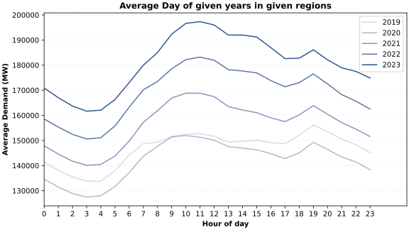

   ### Inferences drawn from the load curves

    - The average load is increasing significantly year-on-year.(Except 2020, This anomaly is taken care of later on.)
    - The overall magnitude of the load is increasing, the shape of the curve also changes.
    - The peak hours of the day have changed from 7PM in 2019 to Late Mornings by 2021. After 2023, the morning hump dominates the evening spike.
    - After 12PM, heading into the afternoon, a decline in the load can be observed.
    - Later in the evening, it spikes up and settles down at a low by the end of the night.
  
   ## Normalization(Ratio-to-Mean)
   - To find %age increase or decrease during demand spikes or crashes cannot be done solely based on the above curve.
   - Thus, we normalize the data. Normalization is just basic division and average
   - Let's normalize the data for the year **2019**, **National** region.
   - 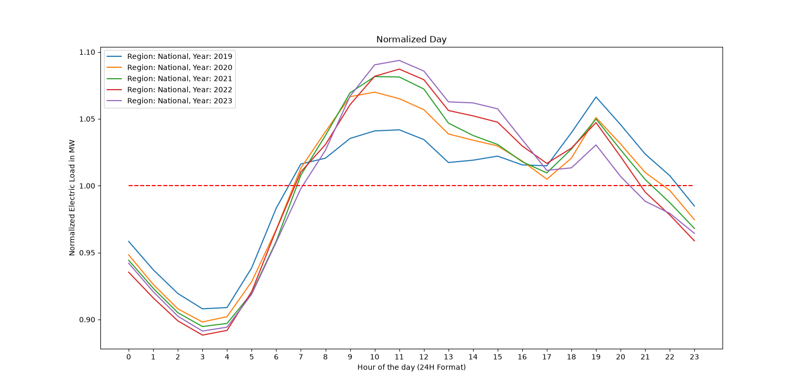
   - Let us average it row-wise to get the average load for each day for the whole year.(Not to be confused with **Average Day**)
   - 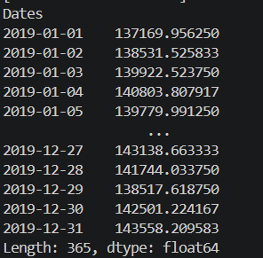
   - From the above figure, we have 365 values corresponding to the average load of each calendar day.
   - Now, the core normalization logic, we divide each row from the former figure with its corresponding mean from the latter figure.
   - It gives us this data:
   - 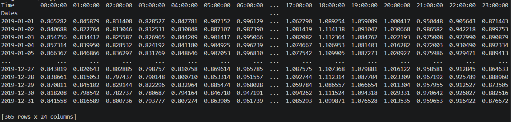

   - Now, to get the **Normalized Load Curve** for 2019, we average the above data column-wise.
   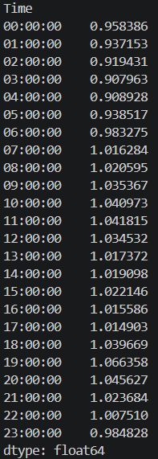
   - Plotting these values for all years 2019-2023 results in the following curve:
   -  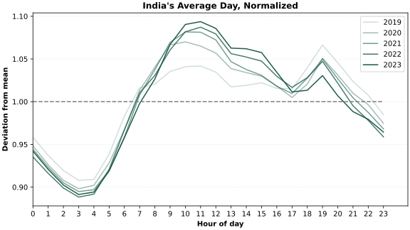

   ### Inferences
    | Year | Morning Spike | Mid-Day dip from peak | Evening Spike |
    |------|---------------|-----------------------|---------------|
    | 2019 |     +4.18%    |     +2.69%            |   +6.64%      |
    | 2020 |      +7.0%    |        +6.51%         |     +5.1%     |
    | 2021 | +8.16%        |       +7.20%          | +4.99%        |
    | 2022 | +8.72%        |  +7.05%               | +4.72%        |
    | 2023 |   +9.37%      |  +8.22%               |  +3.05%       |     
  
   ## 2020: An Outlier
    - By all means, 2020 was an outlier. The biggest reason being the COVID-19 pandemic.
    - Also, Cyclones Nisarga and Amphan, disturbed the West and East regions respectively.
    - Let us look at their effects on electrical load.
  
   ### The COVID-19 Pandemic
    - We already know that the pandemic has caused widespread mayhem. It also reflects in the electric load data.
    - First, let's determine a expected value that 2020 **might** have followed if there was no pandemic.
    - To do so, I have considered the period of 2020 before the lockdown, that is, Jan 1 - Mar 15.
    - Then, Compare it with 2019 to get an expected **growth factor** that 2020 **might** have grown with.
    - To do this, we align the data of  2019 and 2020 by weekday. This is because weekend and weekday alignment is important as the demands differ.
    - But naturally, the dates won't match directly, Ex: Jan 1 2019 is a Tuesday but Jan 1 2020 is a Wednesday. We get such a few mismatches in the start and end, so I dropped those records.
    - Dividing the mean of the data for 2020 by the mean of 2019 gives the **growth factor** as 1.02944.
    - Plotting the expected 2020 data with the actual data we get the following curve
    - 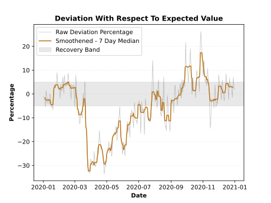
      ### Inferences
    - Between March 25 and September 1, the demand was below the -5% band for 134 days of the total 160 days.
    - The highest deviation, -32.3%, occurred on 27 March, two days after the lockdown began.
  
      ### Deviation Curve
    - From the raw data, I calculated the deviation percentage, that is, ((2020_actual /2020_expected) - 1)*100
    - Let us define -5% to +5% deviation as acceptable, or consequence of other variations.
    - Plotting the deviations, we get:
    - 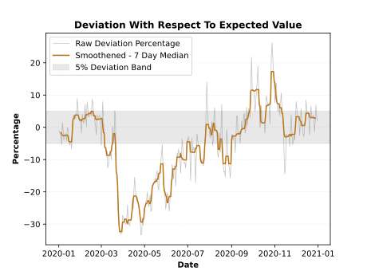

   ### Cyclone Nisarga and Amphan
     - Cyclone Nisarga was the most powerful cyclone that hit Maharashtra since 1981(Wikipedia). This disaster disrupted electric demand and supply in June 2020
     - **NOTE**: The cyclones have caused supply destruction, not demand shocks.
     - The graph highlights it:
     - 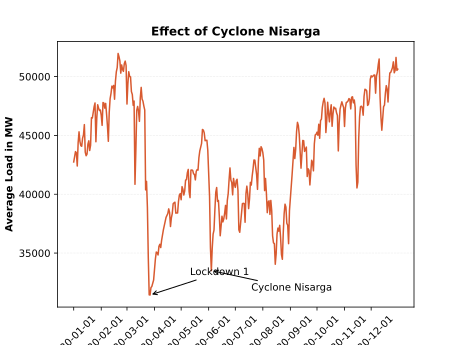
  
     - Cyclone Amphan hit Eastern India around May 21 2020, wreaking havoc in the region.
     - Its impact is listed below:
     - 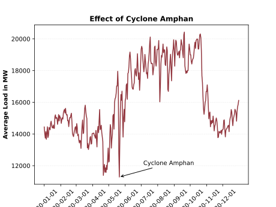
     - There was a dip of 30.8% as a consequence.
       
## Conclusion
 - This project has analyzed the trends and behaviour of electric load from 2019-2023 within the country, while also dealing with major demand shocks.
 - Successfully implemented using Pandas and Matplotlib
